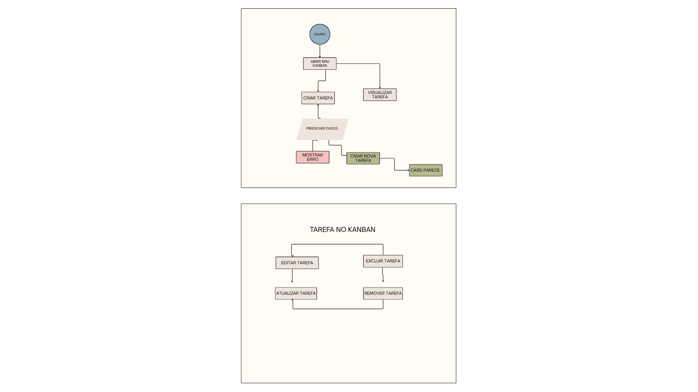
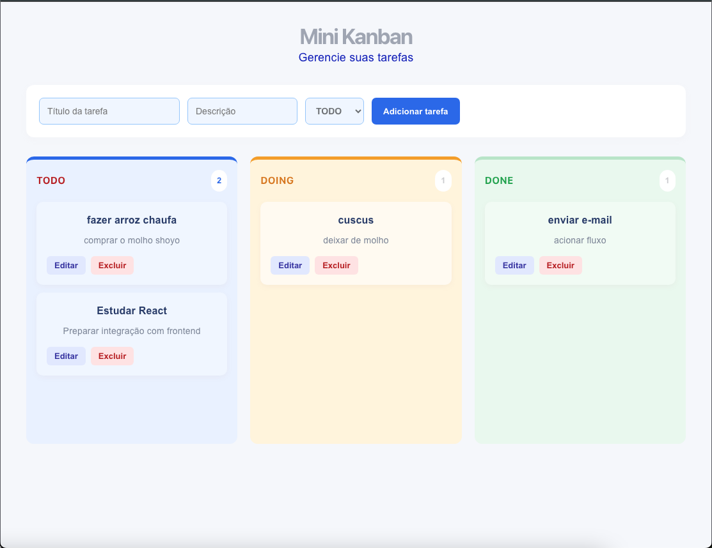

# Mini Kanban

Aplicação Fullstack de gerenciamento de tarefas desenvolvida com React
no frontend e Go no backend.

```text id="6w3c1p"
miniKb/
├── backend/
├── frontend/
├── docs/
├── README.md
└── ...
```

# Mini Kanban de Tarefas

Aplicação Fullstack para gerenciamento de tarefas utilizando **React no frontend** e **Go no backend**, com persistência dos dados em **SQLite**.

O projeto foi desenvolvido como desafio prático Fullstack, com foco em organização de código, integração entre frontend e backend, criação de uma API REST e uma interface simples e responsiva para gerenciamento de tarefas.

---

## 📋 Sobre o projeto

O Mini Kanban permite criar, visualizar, editar e excluir tarefas, organizando-as em três estados:

* **PENDÊNCIA**
* **FAZENDO**
* **FEITO**

A aplicação possui comunicação entre uma interface desenvolvida em React e uma API REST desenvolvida em Go.

Os dados são persistidos em um banco de dados SQLite.

### Fluxo principal

```text
Usuário
   │
   ▼
React + Vite
   │
   │ HTTP / JSON
   ▼
API REST - Go
   │
   ▼
Repository
   │
   ▼
SQLite
```

---

# 🚀 Funcionalidades

### Gerenciamento de tarefas

* [x] Listar tarefas
* [x] Editar tarefa
* [x] Excluir tarefa
* [x] Alterar status da tarefa
* [x] Validação dos dados
* [x] Persistência em SQLite

### Interface
## 📸 Interface


* [x] Visualização em formato Kanban
* [x] Separação por status
* [x] Contador de tarefas por coluna
* [x] Formulário para criação
* [x] Edição diretamente no card
* [x] Exclusão de tarefas
* [x] Feedback visual por cores
* [x] Layout responsivo

---

# 🛠️ Tecnologias utilizadas

## Frontend

* React
* JavaScript
* Vite
* HTML5
* CSS3
* Fetch API

## Backend

* Go
* `net/http`
* SQLite
* `database/sql`
* `modernc.org/sqlite`

## Ferramentas

* Git
* GitHub
* VS Code
* Terminal
* cURL

---

# 📁 Estrutura do projeto

```text
miniKb/
│
├── backend/
│   │
│   ├── cmd/
│   │   └── server/
│   │       └── main.go
│   │
│   ├── internal/
│   │   │
│   │   ├── database/
│   │   │   └── database.go
│   │   │
│   │   ├── handlers/
│   │   │   └── task_handler.go
│   │   │
│   │   ├── models/
│   │   │   └── task.go
│   │   │
│   │   └── repository/
│   │       └── task_repository.go
│   │
│   ├── go.mod
│   ├── go.sum
│   └── kanban.db
│
├── frontend/
│   │
│   ├── src/
│   │   ├── components/
│   │   │   ├── KanbanColumn.jsx
│   │   │   ├── TaskCard.jsx
│   │   │   └── TaskForm.jsx
│   │   │
│   │   ├── services/
│   │   │   └── api.js
│   │   │
│   │   ├── App.jsx
│   │   ├── App.css
│   │   └── main.jsx
│   │
│   ├── package.json
│   └── vite.config.js
│
├── docs/
│   └── user-flow.png
│
└── README.md
```

---

# 🧩 Arquitetura do Backend

O backend foi organizado seguindo uma separação simples de responsabilidades.

```text
HTTP Request
     │
     ▼
  Handler
     │
     ▼
 Repository
     │
     ▼
  Database
```

### Handler

Responsável por:

* receber requisições HTTP;
* interpretar JSON;
* validar dados;
* definir status HTTP;
* retornar respostas JSON.

### Repository

Responsável pela comunicação com o banco de dados.

Exemplos:

```text
GetAll()
Create()
Update()
Delete()
```

### Model

Representa a entidade `Task`.

```go
type Task struct {
    ID          int       `json:"id"`
    Title       string    `json:"title"`
    Description string    `json:"description"`
    Status      string    `json:"status"`
    CreatedAt   time.Time `json:"createdAt"`
}
```

### Database

Responsável pela conexão com SQLite e criação da tabela `tasks`.

---

# 🔌 API REST

A API utiliza JSON para comunicação entre frontend e backend.

## Listar tarefas

```http
GET /tasks
```

Exemplo:

```json
[
  {
    "id": 1,
    "title": "Estudar React",
    "description": "Preparar integração",
    "status": "todo",
    "createdAt": "2026-08-15T01:06:51Z"
  }
]
```

---

## Criar tarefa

```http
POST /tasks
```

Body:

```json
{
  "title": "Estudar React",
  "description": "Preparar integração com frontend",
  "status": "todo"
}
```

Resposta:

```http
201 Created
```

---

## Atualizar tarefa

```http
PUT /tasks/:id
```

Exemplo:

```http
PUT /tasks/1
```

Body:

```json
{
  "title": "Estudar React",
  "description": "Revisar componentes",
  "status": "doing"
}
```

Resposta:

```http
204 No Content
```

---

## Excluir tarefa

```http
DELETE /tasks/:id
```

Exemplo:

```http
DELETE /tasks/1
```

Resposta:

```http
204 No Content
```

---

# ✅ Validações

A API possui validações para impedir tarefas inválidas.

### Título

O título é obrigatório.

```text
título é obrigatório
```

### Status

O status é obrigatório e deve ser um dos valores:

```text
todo
doing
done
```

Caso contrário:

```text
status inválido
```

---

# 💻 Como executar o projeto

## Pré-requisitos

Antes de iniciar, é necessário ter instalado:

* Go
* Node.js
* npm
* Git

Verifique as versões:

```bash
go version
```

```bash
node --version
```

```bash
npm --version
```

---

# ▶️ Executando o Backend

Entre na pasta:

```bash
cd backend
```

Instale as dependências:

```bash
go mod tidy
```

Execute o servidor:

```bash
go run ./cmd/server
```

O backend ficará disponível em:

```text
http://localhost:8080
```

---

# ▶️ Executando o Frontend

Abra outro terminal.

Entre na pasta:

```bash
cd frontend
```

Instale as dependências:

```bash
npm install
```

Execute o projeto:

```bash
npm run dev
```

O Vite disponibilizará a aplicação em um endereço semelhante a:

```text
http://localhost:5173
```

Abra o endereço informado pelo Vite no navegador.

---

# 🧪 Testando a API

Também é possível testar a API utilizando `curl`.

### Criar tarefa

```bash
curl -i -X POST http://localhost:8080/tasks \
-H "Content-Type: application/json" \
-d '{"title":"Estudar Go","description":"Praticar API REST","status":"todo"}'
```

### Listar tarefas

```bash
curl -i http://localhost:8080/tasks
```

### Atualizar tarefa

```bash
curl -i -X PUT http://localhost:8080/tasks/1 \
-H "Content-Type: application/json" \
-d '{"title":"Estudar Go","description":"Praticar API REST","status":"doing"}'
```

### Excluir tarefa

```bash
curl -i -X DELETE http://localhost:8080/tasks/1
```

---

# 🔄 Fluxo de uso

O fluxo principal da aplicação é:

```text
                    ┌──────────────┐
                    │    Usuário   │
                    └──────┬───────┘
                           │
                           ▼
                  ┌─────────────────┐
                  │ Abrir Kanban    │
                  └────────┬────────┘
                           │
                           ▼
                  ┌─────────────────┐
                  │ Criar tarefa    │
                  └────────┬────────┘
                           │
                           ▼
                  ┌─────────────────┐
                  │      TODO       │
                  └────────┬────────┘
                           │
                           ▼
                  ┌─────────────────┐
                  │ Editar tarefa   │
                  └────────┬────────┘
                           │
                           ▼
                  ┌─────────────────┐
                  │     DOING       │
                  └────────┬────────┘
                           │
                           ▼
                  ┌─────────────────┐
                  │     DONE        │
                  └────────┬────────┘
                           │
                    ┌──────┴──────┐
                    │             │
                    ▼             ▼
                 Editar        Excluir
```

O diagrama visual também pode ser disponibilizado na pasta:

```text
docs/user-flow.png
```

---

# 🎨 Interface

A interface foi desenvolvida com foco em simplicidade e facilidade de utilização.

As tarefas são organizadas visualmente em três colunas:

```text
┌───────────────┐
│  PENDÊNCIA    │
│               │
│  Task         │
│  Task         │
└───────────────┘

┌───────────────┐
│    FAZENDO    │
│               │
│  Task         │
└───────────────┘

┌───────────────┐
│     FEITO     │
│               │
│  Task         │
└───────────────┘
```

As cores ajudam a diferenciar visualmente os estados das tarefas.

---

# 📌 Decisões técnicas

Algumas decisões tomadas durante o desenvolvimento:

### React + Vite

Utilizado para criar uma interface rápida e componentizada.

### Go `net/http`

O backend utiliza recursos nativos do Go para manter a API simples e objetiva.

### Repository Pattern

A camada de repository separa a lógica de acesso ao banco da camada HTTP.

### SQLite

Escolhido por ser simples de configurar e adequado para o escopo de um Mini Kanban.

### Componentização

O frontend foi dividido em componentes:

```text
App
 │
 ├── TaskForm
 │
 └── KanbanColumn
       │
       └── TaskCard
```

Isso facilita manutenção e evolução da aplicação.

---

# 🔮 Possíveis melhorias

Como evolução futura do projeto:

* [ ] Drag and Drop entre colunas
* [ ] Testes automatizados no backend
* [ ] Testes automatizados no frontend
* [ ] Paginação
* [ ] Autenticação de usuários
* [ ] Docker
* [ ] Deploy da aplicação
* [ ] Banco PostgreSQL
* [ ] Filtros e busca de tarefas
* [ ] Confirmação antes da exclusão
* [ ] Mensagens de sucesso e erro mais detalhadas

---
#  Visual :


#  Desenvolvedor

**Jahaziel Pomahualca**

Projeto desenvolvido como desafio prático Fullstack.

---

# 📄 Licença

Este projeto foi desenvolvido para fins educacionais e de demonstração de habilidades técnicas.

````

## 


